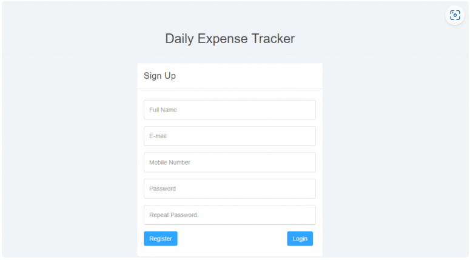
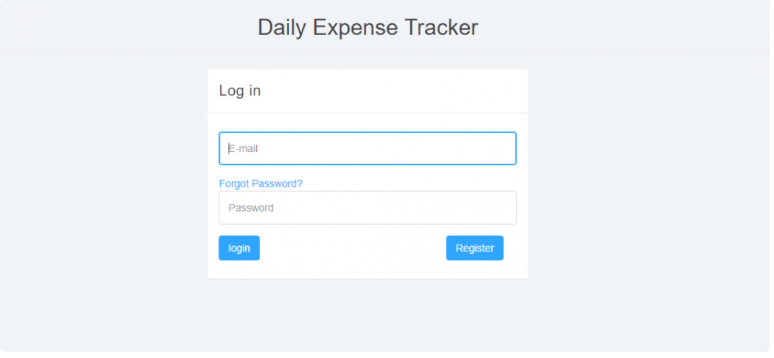
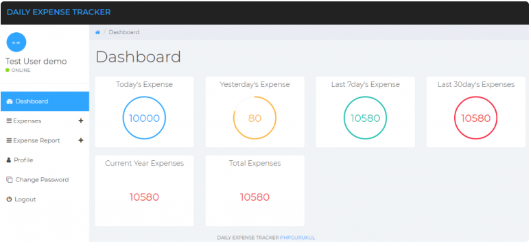

# Daily Expense Tracker System

A simple **web-based application** built with **PHP** and **MySQL** to help users manage their daily expenses.  
This project allows users to record, view, and analyze their expenses with an intuitive dashboard.

---

## 🚀 Features
- **Dashboard**: View expenses on a daily, monthly, and yearly basis.  
- **Expense Management**: Add or delete expenses easily.  
- **Expense Reports**: Generate reports by day, month, or year.  
- **Profile Management**: Update user profile details.  
- **Password Management**: Change or recover passwords.  
- **Authentication**: Secure login and logout system.  

---

## 🛠️ Tech Stack
- **Language:** PHP 5.6 / PHP 7.x  
- **Database:** MySQL 5.x  
- **Frontend:** HTML, AJAX, jQuery, JavaScript  
- **Server:** XAMPP / WAMP / LAMP / MAMP  
- **Browsers Supported:** Chrome, Firefox, Opera, IE8+  

---

## 📸 Screenshots

### User Signup

### User Login

### User Dashboard

*(Replace `assets/...` with the actual paths to your screenshots in the repo.)*

---

## ⚙️ Installation

1. Download and extract the project files.  
2. Copy the `dets` folder into your server root directory:  
   - XAMPP → `htdocs`  
   - WAMP → `www`  
   - LAMP → `/var/www/html`  
3. Open **phpMyAdmin** and create a database named `detsdb`.  
4. Import the `detsdb.sql` file from the `sql` folder.  
5. Run the project in your browser:http://localhost/dets  

---

## 🔑 Default Credentials
- **Username:** `testuser@gmail.com`  
- **Password:** `Test@123`  

*(Or register a new account via the signup page.)*

---

## 🤝 Contributing
Pull requests are welcome! For major changes, please open an issue first to discuss what you’d like to change.

---

## 📜 License
This project is licensed under the MIT License.
